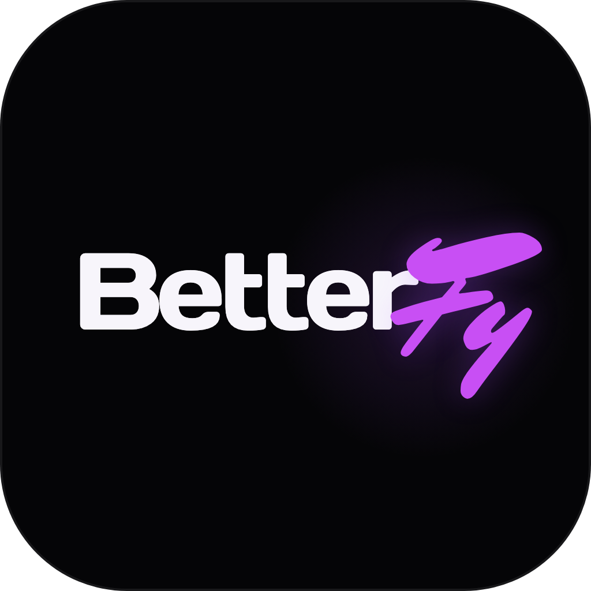

<p align="center">
  
</p>

<h1 align="center">BetterFy</h1>

<p align="center">
  A Windows-first desktop workspace for building a custom Dota 2 setup.<br />
  Discover, inspect, resolve, build, verify, activate, and recover in one place.
</p>

<p align="center">
  <a href="https://github.com/zori-xyz/BetterFy/actions/workflows/windows-build.yml"></a>
  <a href="https://github.com/zori-xyz/BetterFy/actions/workflows/release.yml"></a>
  
  
</p>

<p align="center">
  <a href="#what-it-does">Product</a> ·
  <a href="#current-status">Status</a> ·
  <a href="#run-it-locally">Development</a> ·
  <a href="#repository-map">Repository map</a> ·
  <a href="docs/README.md">Documentation</a> ·
  <a href="CONTRIBUTING.md">Contributing</a>
</p>

---

## What it does

BetterFy brings functional mods, visual content, local configurations, build
review, and recovery into one desktop application. The product is designed for
players who want a coherent setup without manually collecting scripts and packs
from unrelated sources.

The intended journey is deliberately simple:

```text
Connect Dota → choose content → resolve conflicts → review the build
→ verify → activate → open Steam → recover or rebuild
```

Windows is the release target. macOS is used for interface development and
synthetic testing.

## Current status

BetterFy is in active development. The interface is broad; the engine is being
enabled in small, recoverable slices.

| Area | State | What is true today |
| --- | --- | --- |
| Dota discovery | Implemented | Steam libraries are discovered and candidate installations are verified through marker files. |
| Build planning | Implemented for fixtures | Deterministic plans, content hashes, conflict detection, staging, journals, verification, and rollback run in BetterFy-owned app data. |
| Steam profile activation | Implemented | A confirmed profile can be backed up, updated atomically, verified, rolled back, and followed by a Steam-only restart. |
| Catalog and wardrobe | Product preview | Navigation, filtering, provenance fields, and local selection work; content download is not enabled. |
| Presets | Implemented locally | Configurations are validated and stored atomically; JSON import and export are available. |
| Authentication | Preview boundary | Telegram verification has a backend boundary and an explicit demo fallback. Production auth is not live. |
| Dota file deployment | Not enabled | BetterFy does not write a production VPK or replace Dota 2 files yet. |
| Public updates | Prepared, not released | Signed updater infrastructure exists; public releases require signing secrets and release approval. |

No current build claims VAC safety, ban immunity, universal compatibility, or
production-ready game-file recovery.

## Run it locally

Requirements:

- Node.js 22+
- Rust stable
- platform prerequisites for Tauri 2

```bash
npm install
npm run tauri dev
```

For interface-only work in a browser:

```bash
npm run dev
```

Browser mode uses explicit demo boundaries for desktop-only behavior.

### Quality checks

```bash
npm run check
npm run visual:check
cargo fmt --all --manifest-path src-tauri/Cargo.toml -- --check
cargo clippy --locked --manifest-path src-tauri/Cargo.toml -- -D warnings
```

`npm run visual:check` walks the main RU/EN and light/dark journeys at the
supported desktop viewports. The Windows workflow repeats the build, tests,
format check, Clippy, and NSIS packaging on a native runner.

## Build for Windows

On Windows 10 or 11 with Microsoft C++ Build Tools installed:

```powershell
.\scripts\build-windows.ps1
```

The unsigned internal installer is written to:

```text
src-tauri\target\release\bundle\nsis\
```

Every push to `main` and every pull request produces a native Windows check.
Unsigned artifacts are for internal testing; signed public releases use a
separate tag-driven workflow.

- [Windows build guide](docs/WINDOWS_BUILD.md)
- [Release and updater guide](docs/RELEASING.md)
- [Latest Windows workflow runs](https://github.com/zori-xyz/BetterFy/actions/workflows/windows-build.yml)

## Repository map

| Path | Purpose |
| --- | --- |
| [`src/`](src/) | React interface, product routes, localization, catalogs, and the typed engine bridge |
| [`src-tauri/src/`](src-tauri/src/) | Rust commands, Dota discovery, staging, journals, Steam configuration, presets, and runtime control |
| [`src-tauri/fixtures/`](src-tauri/fixtures/) | Repository-owned engine fixtures used to prove planning and recovery safely |
| [`scripts/`](scripts/) | Windows builds, catalog checks, icon verification, and visual journey audits |
| [`docs/`](docs/) | Architecture, product rules, Minify research, Windows builds, releases, and roadmap |
| [`.github/`](.github/) | Native Windows CI, signed releases, ownership, and contribution templates |

For a guided tour, start with [the documentation index](docs/README.md).

## Engine safety model

Privileged decisions live in Rust. React presents state and collects explicit
confirmation; it does not decide whether a path or operation is safe.

The current engine follows these rules:

- reject unknown inputs, traversal, symlinks, stale plans, and foreign launch-option conflicts;
- stop Dota and Steam before a privileged Steam configuration write;
- create and verify a private backup before replacement;
- publish through an atomic operation and keep a durable journal;
- verify the committed bytes before starting Steam;
- start Steam only, never Dota 2;
- refuse rollback when an unrelated external edit would be overwritten.

The production game-file pipeline must meet the same contract before Dota
deployment is enabled. See [engine architecture](docs/ENGINE_ARCHITECTURE.md)
and the [patching audit](docs/MINIFY_PATCHING_AUDIT.md).

## Branches and changes

`main` is the integration branch and must remain green. Work is prepared in
short-lived branches:

```text
feature/<scope>   product or engine work
fix/<scope>       bug fixes
docs/<scope>      documentation only
chore/<scope>     tooling and maintenance
release/vX.Y.Z    release preparation
```

Pull requests should be small enough to review, state the tested operating
system, and distinguish real behavior from preview behavior. Full conventions
are in [CONTRIBUTING.md](CONTRIBUTING.md) and
[the repository guide](docs/REPOSITORY_GUIDE.md).

## Documentation

- [Product definition](PRODUCT.md)
- [Design system](DESIGN.md)
- [Experience constitution](docs/EXPERIENCE_CONSTITUTION.md)
- [Engine architecture](docs/ENGINE_ARCHITECTURE.md)
- [Minify patching audit](docs/MINIFY_PATCHING_AUDIT.md)
- [Roadmap](docs/ROADMAP.md)
- [Third-party notices](THIRD_PARTY_NOTICES.md)

## Community

Early Access news, setup help, and product feedback are handled through
[@BetterFyBot](https://t.me/BeterFyBot).

## Legal status

BetterFy is licensed under the [GNU General Public License v3.0](LICENSE).
Third-party catalog metadata and prototype imagery have separate provenance
and release restrictions documented in
[THIRD_PARTY_NOTICES.md](THIRD_PARTY_NOTICES.md) and [DESIGN.md](DESIGN.md).

Dota 2 and related marks and assets belong to Valve Corporation. BetterFy is an
independent project and is not affiliated with or endorsed by Valve.

